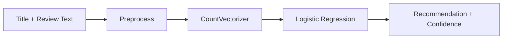

# Atelier — Clothing Review Recommendation System

A full-stack NLP application that predicts whether a customer would recommend a clothing item based on review text. Built with Python, scikit-learn, and Flask.

Browse a product catalog, search by keyword, submit reviews, and see ML-powered recommendation predictions with confidence scores.

## Highlights

- **19,662 reviews** from women's e-commerce clothing data
- **89.9% accuracy** and **93.8% F1** on a stratified 80/20 hold-out test set
- End-to-end NLP pipeline with shared preprocessing for training and inference
- Model comparison across 3 baseline approaches (documented in notebook)
- Flask web UI with pagination, category browsing, stem-based search, and review workflow

## ML Pipeline



**Preprocessing:** lowercase tokenization, stopword removal, single-character filter  
**Features:** bag-of-words (`CountVectorizer`, `min_df=2`)  
**Classifier:** logistic regression (`max_iter=1000`, `random_state=42`)

### Hold-out evaluation (production model)

| Metric    | Score  |
|-----------|--------|
| Accuracy  | 89.9%  |
| Precision | 93.1%  |
| Recall    | 94.6%  |
| F1        | 93.8%  |

Confusion matrix (rows = actual, columns = predicted):

|           | Pred 0 | Pred 1 |
|-----------|--------|--------|
| Actual 0  | 489    | 226    |
| Actual 1  | 173    | 3,045  |

### Model comparison

| Vectorizer | Classifier      | Accuracy | F1    | Train time |
|------------|-----------------|----------|-------|------------|
| Count      | Logistic Reg.   | 89.9%    | 93.8% | 0.43s      |
| TF-IDF     | Logistic Reg.   | 89.7%    | 93.9% | 0.33s      |
| TF-IDF     | Naive Bayes     | 84.9%    | 91.5% | 0.28s      |

Count + logistic regression was selected for production: best accuracy with strong interpretability.

## Project structure

```
app/
├── app.py                    # Flask web application
├── nlp.py                    # Text preprocessing and search scoring
├── ml.py                     # Training, evaluation, inference, model persistence
├── evaluate_models.py        # Run hold-out eval + model comparison
├── models/
│   ├── recommendation_model.joblib
│   └── evaluation_results.json
├── notebooks/
│   └── eda_and_evaluation.ipynb
├── tests/
│   └── test_ml.py
├── templates/                # Jinja2 HTML templates
├── static/                   # CSS and images
└── assignment3_II.csv        # Dataset (19,662 reviews)
```

## Quick start

```bash
cd app
python -m venv venv
.\venv\Scripts\activate        # Windows
# source venv/bin/activate     # macOS/Linux

pip install -r requirements.txt
python evaluate_models.py      # optional: retrain + regenerate metrics
python app.py
```

Open [http://127.0.0.1:5000](http://127.0.0.1:5000)

## Run tests

```bash
pytest tests/ -v
```

## Notebook

`notebooks/eda_and_evaluation.ipynb` covers:

- Class balance, rating distribution, and text length analysis
- Hold-out evaluation with confusion matrix
- Side-by-side model comparison charts

## Features

- **Catalog** — paginated product grid with avg rating and recommendation %
- **Categories** — browse by department
- **Search** — Porter-stemmed keyword matching ranked by token overlap
- **Review flow** — submit review → ML prediction with confidence → confirm or override → persist to CSV

## Tech stack

Python · scikit-learn · pandas · NLTK · Flask · Jupyter · pytest

## Dataset

[Womens E-Commerce Clothing Reviews](https://www.kaggle.com/datasets/nicapotato/womens-ecommerce-clothing-reviews) (Kaggle)
